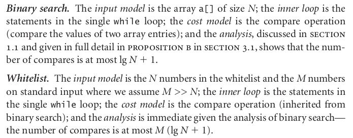
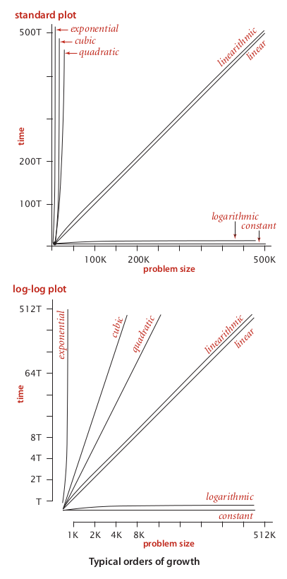
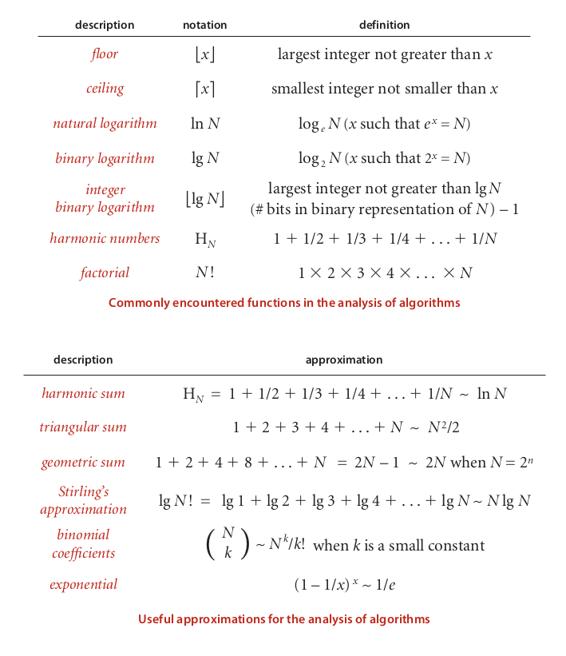

# Algorithm analysis

The "efficiency" of an algorithm usually refers to either its running time w.r.t input (time complexity) or the amount of memory it consumes w.r.t. input (space complexity).

Here we are focusing on the *basic asymptotic analysis* of algorithm efficiency. We make mathematical approximations where appropriate, and we intentionally ignore the details of underlying hardware, compilers, etc. Focusing on the algorithm itself makes our analysis simpler and more general.


## General procedure for analyzing an algorithm's running time

1. Define an input model. An input model = the input type (arrays, graphs, etc) + variable properties of the input that can significantly affect running time. Focus on variable properties related to *size* of input (number of elements in the input array, number of vertices in the input graph, etc).
	- For simplicity and generality of our analysis, we usually ignore variable characteristics like the specific contents of the input array. We default to setting these kinds of characteristics to be the worst possible case, in which case our analysis would give us an *upper bound* on the algorithm's running time.
	- The question we want to answer through our analysis is: *how does the algorithm's running time vary w.r.t. these input properties?*

2. Define a cost model. A cost model = small snippets of the algorithm (usually single operations like memory accesses, comparisons, or function calls) whose frequency of execution can capture the bulk of the algorithm's computation time. Focus on operations in the innermost loops or recursive calls.

3. Determine the number of times the operations in our cost model are executed w.r.t the properties identified in our input model. This serves as an approximate representation of the algorithm's running time.

4. Simplify the result of step 3 as follows to get the *order of growth* of the algorithm's running time. Use this order of growth as a baseline characterization of the algorithm's running time.
	- Throw away low-order terms. These generally become insignificant as input sizes grow large.
		- ```3N^2 + 61N + 162``` simplifies to ```3N^2```
	- Throw away constant scaling factors. These generally become insignificant (overpowered by differences in order of growth) as input sizes grow large. Furthermore, constant scaling factors can be dependent on machine-specific or input-specific characteristics, which complicates our models / analysis.
		- ```3N^2``` simplifies to ```N^2```
		- ```log base 2 of N``` simplifies to ```log(N)```
	- Note that this characterization by order of growth may hide many details about the true performance of the algorithm. However, in general, this serves as a nice simple way to reason about and compare algorithm efficiency.


### Example following above procedure

(from *Sedgewick*, p184)




## Visualizing orders of growth

(from *Sedgewick*, p188)




## Notation for asymptotic analysis

[Explanations of Big Theta and Big O notation from CS61B](https://www.youtube.com/watch?v=CGdubALgQw4&list=PL8FaHk7qbOD4oAdQOZ765z6aeqyKs2593&index=8)


## Some misc relevant math background

(from *Sedgewick*, p185)



